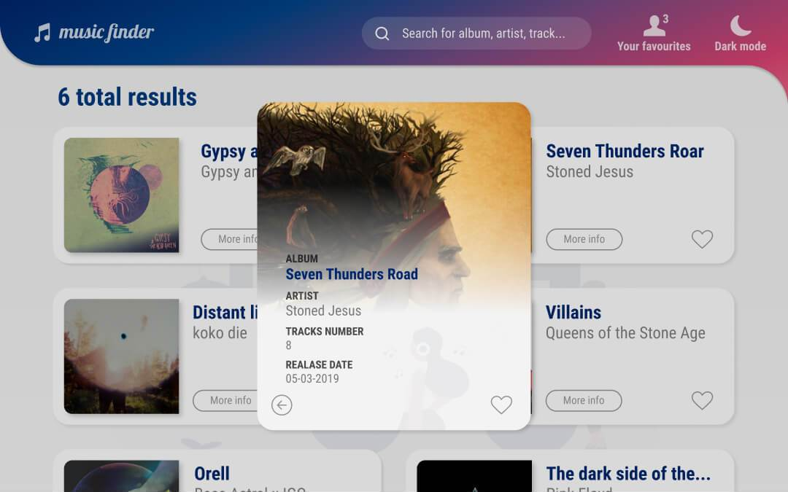

# Figma app design

Mobile and desktop layouts for my [Music Finder App](https://github.com/bartekszajna/) created with the use of [Figma](https://figma.com), free design&prototyping tool. Both versions exclusively built by me.

Along the process I was taking advantage of [dribbble](https://dribbble.com/) and [awwwards](https://www.awwwards.com/) to find suitable design ideas and inspiration.

Those nice .svg icons used for backgrounds come from 
[unDraw](https://undraw.co/), incredible source of absolutely free 
vector graphics.

## Mobile version light

  
  

  
  
  

## Mobile version dark

  
  

  
  
  

## Desktop version light

  
  

## Desktop version dark

  
  

